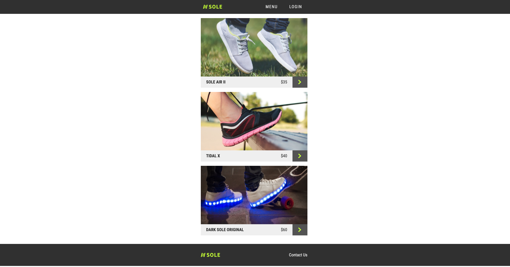

# Soles
Link to project deployed with netlify. Live demo [here](https://sole-sports.netlify.app/)

## Table of Content
* General Information
* Technologies Used
* Features
* Screenshot
* Installation and Setup Instructions
* Usage
* Project Status
* Room for Improvement
* Acknowledgements
* Contact

## General Information

Soles is a static shoes store that I built to showcase what can be done using jQuery.

### Purpose of this project

To practice using jQuery.

## Technologies Used

* HTML
* CSS
* JavaScript
* jQuery

## Features

* Interactive navigation bar and buttons.

## Screenshot
Version 1.0 

## Installation and Setup Instructions

1. Clone down this repository. You will need node and `npm` installed globally on your machine. 

2. Type `npm i` to install packages. 

3. Run/open index.html in local browser.

## Usage

**Observe jQuery in Action**

* Interact with the navigation bar and buttons on the website.

## Project Status
Project is: Completed

## Room for Improvement
* Make the footer interactive.
* Make the display computer friendly.

## Acknowledgements
* Many thanks to Codecademy.

## Contact
Created by Abeer Ahmed [LinkedIn profile](https://www.linkedin.com/in/abeerfrontend/) - feel free to contact me.

